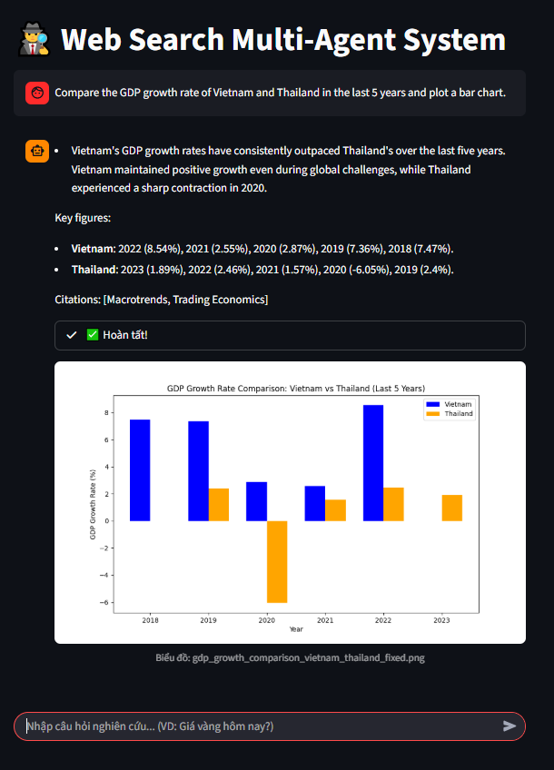

# WebSearchMultiAgent

⚠️ This repo is still under development — it’s only at **POC stage** for now.

A small multi-agent web research + charting playground built with **LangGraph + LangChain + Tavily**, with:
- a Streamlit UI
- a simple CLI chat loop
- TruLens benchmark + evaluation dashboard

## What it does (POC features)

Agents:
- **planner**: breaks a user request into steps
- **executor**: decides which agent runs next (and when to replan)
- **web_researcher**: fetches public info via Tavily search
- **chart_generator**: writes Python (matplotlib) to plot charts and save `.png`
- **chart_summarizer**: summarizes the chart result
- **synthesizer**: writes the final answer

Run modes:
- UI (Streamlit chat)
- CLI (`src/main.py`)
- Benchmark + dashboard (TruLens)

## Example (Vietnam vs Thailand)

Prompt used to generate the example chart:

> "Compare the GDP growth rate of Vietnam and Thailand in the last 5 years and plot a bar chart."

Example output image (already in this repo):



## Install

### 1) Clone

```bash
git clone https://github.com/nnminh322/nnminh322-websearchmultiagent.git
cd nnminh322-websearchmultiagent
```

### 2) Create venv + install deps

```bash
python -m venv .venv

# Windows:
.venv\Scripts\activate

# macOS/Linux:
source .venv/bin/activate

pip install -r src/requirements.txt
```

### 3) Environment variables

Copy the example env file to project root:

```bash
cp src/.env.example .env
```

Edit `.env` and fill in keys.

Minimum for web search:
- `TAVILY_API_KEY`

This project also reads per-agent API keys (see `src/configs/agent_config.yaml`):
- `default_api`
- `planner_api`
- `executor_api`
- `web_researcher_api`
- `chart_generator_api`
- `chart_summarizer_api`
- `synthesizer_api`

(You can point all of them to the same key if you want — I separated them for flexibility.)

## How to run

### 1) Streamlit UI

```bash
streamlit run src/ui.py
```

Notes:
- The UI streams through the agent graph and shows node progress.
- If a new `.png` is created recently, the UI will try to display the latest chart.

### 2) CLI mode (simple chat loop)

```bash
python src/main.py
```

Type `exit` / `quit` to stop.

### 3) Run benchmark (TruLens recording)

File name is currently `benmark.py` (typo kept as-is):

```bash
python src/benmark.py
```

### 4) Open TruLens dashboard

```bash
python src/dashboard.py
```

## Repo map (quick)

- `src/orchestrations/` — LangGraph state + workflow graph
- `src/agents/` — planner/executor/web_researcher/chart_generator/chart_summarizer/synthesizer
- `src/configs/` — YAML configs + prompt/instruction templates
- `src/evaluation/` — TruLens setup + metrics wrapper
- `src/ui.py` — Streamlit UI
- `src/main.py` — CLI chat
- `src/benmark.py` — benchmark runner
- `src/dashboard.py` — TruLens dashboard launcher

## POC quirks (not cleaned up yet)

- `chart_generator` saves charts to the current working directory.
- The Streamlit UI scans `*.png` in the working directory to show the latest chart.

## License

No license yet (POC stage). Add one if you plan to open-source it properly.
